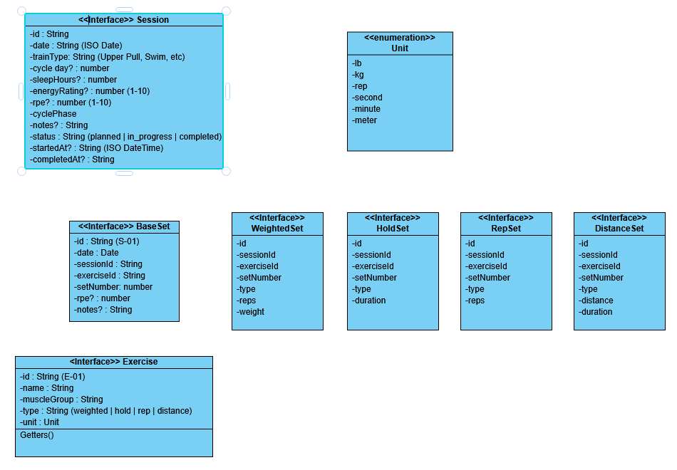

# training-tracker

TrainingTracker is an MVP web app created with TypeScript which will live on GitHub pages and be added to my phone homescreen to appear as a local app. I will be able to download and upload csv data to backup my progress.

https://claude.ai/share/ae0db2d0-20d2-40cb-84ab-50a49ff81bf8

